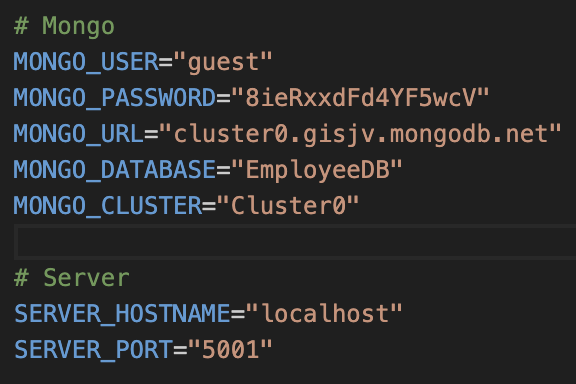
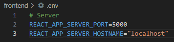
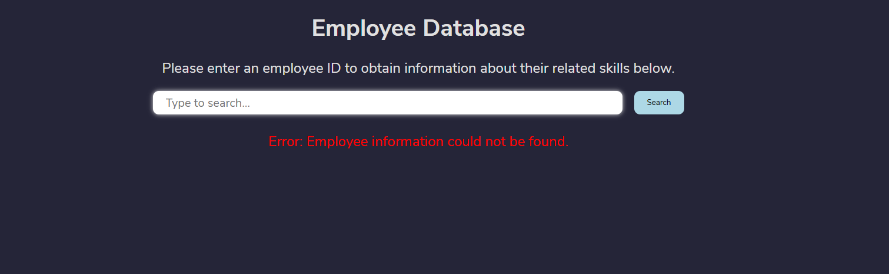

# FullStackAPI

## Overview

Welcome to my Full-Stack API project which interfaces an Employee Database! This API communicates with MongoDB to store employee names and relevant skills, uses TypeScript with Express to set up routes (GET, GET-all, POST, PATCH, DELETE, and POST-query), and uses TypeScript with React to create a front-end component which returns a GET route given an employee ID. Below are some steps on how to get started with using this API!

## Directions

1. Once you have cloned this repository, enter the main working directory and install required dependencies by typing `npm install` into a terminal opened within this directory.
2. Create a `.env` file in the working directory and enter the following information, filling in your MongoDB credentials where necessary:

  

3. Now, enter the frontend directory and install required dependencies by typing `npm install` into a terminal opened within this directory.

4. Create a `.env` file in the frontend directory and enter the following information *exactly*:

  

5. Return to the working directory and ensure nodemon is installed by typing `npm install -g nodemon` in a terminal opened within the working directory.

6. Type `nodemon` in the terminal to run the API router.

7. Enter the frontend directory again and type `npm start` in a terminal opened within this directory to start a local React server. This should grant you access to a page similar to this one:

  

8. Using MongoDB or Postman Query routes, determine a valid employee ID in the database and enter it into the search bar on the front end. Hit enter and view the results of your GET route!
